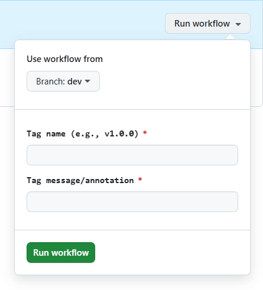

# Create Git Tag Workflow Runbook

## Overview

This runbook covers the manual, on-demand GitHub Action that creates an annotated Git tag and pushes it to the repository.

## Intended Users

- Configuration Manager
- Any GitHub user with permission to run workflow dispatch actions in this repository

## Preconditions

- The workflow must remain enabled in the repository.
- The GitHub token used by the workflow must have permission to push tags to the repository.

## Inputs
- `branch` (required): Drop-down select branch. 
- `tag` (required): Tag name to create (example: `v1.0.0`).
- `message` (required): Tag annotation message.

## How to Run (GitHub Web)

1. Open the repository in GitHub.
2. Select the **Actions** tab.
3. Choose **Create Git Tag** from the workflow list.
4. Click **Run workflow**.
5. Fill in the required inputs:
   - `branch` 
   - `tag`
   - `message`
6. Click **Run workflow** to start the job.

## What the Workflow Does

1. Checks out the repository with full history.
2. Sets a git identity for the workflow.
3. Creates an annotated tag using the provided inputs.
4. Pushes the tag to the remote.
5. Prints a summary in the workflow logs.

## Expected Results

- A new annotated tag exists in the repository with the provided name and message.
- The workflow run completes successfully.

## Troubleshooting

- **Tag already exists**: The run will fail when `git tag -a` attempts to create a tag with an existing name. Choose a new tag name or delete the existing tag before re-running.
- **Permission errors**: Ensure the workflow token has permission to push tags in the repository settings.
- **Empty branch line in summary**: The workflow summary prints a `branch` input that is not defined in this workflow; this is expected with the current workflow configuration.

## Related

- PowerShell tagging helper: `git-tag.ps1` runbook in [git-tag.md](git-tag.md)
